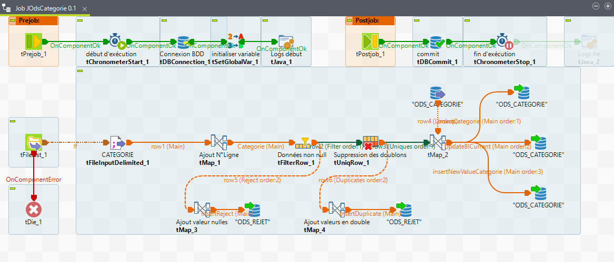
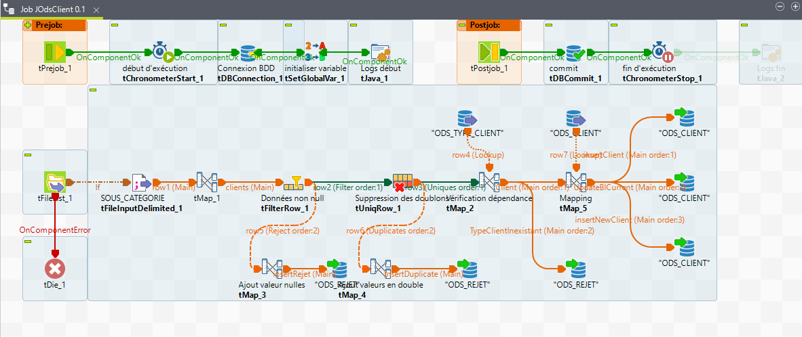
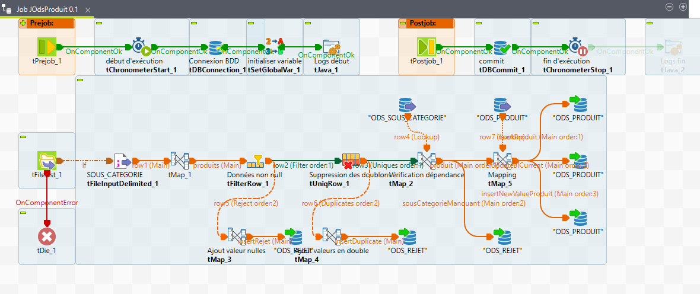
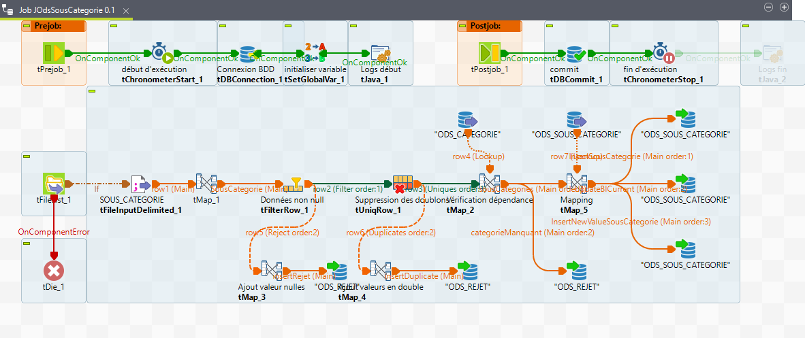
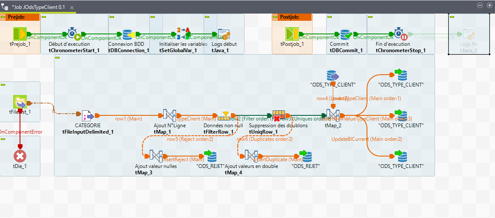
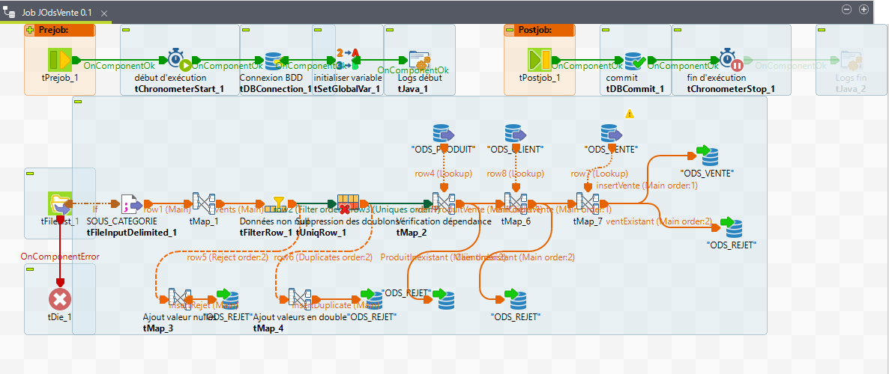

# talend-data-integration-project-commercial-data-management
## Objectif 
Creation of a Data Integration System in a Data Warehouse

The project consisted of two distinct parts:

### Part 1: Loading the ODS
In this phase, I set up a PostgreSQL database (COM_INGESTION_DB) and developed SQL scripts for schema creation, table creation, and data insertion. I carefully managed the ingestion process, ensuring seamless integration of flat files into the database using Talend's powerful data integration capabilities. Key tasks included:

- Creating database schemas (VENTE_ODS and PARAMS_LOG).
- Configuring and executing SQL scripts for table creation and data insertion.
- Developing Talend jobs within the ICOMMERCE_REPORTING project for transforming and loading data into the operational data store (ODS).
- Implementing custom Java code for specialized data processing tasks.
### Part 2: Loading the DWH
In this phase, I expanded the PostgreSQL database to include a data warehouse (VENTE_DWH) for advanced analytics and reporting purposes. Similar to Part 1, I developed SQL scripts for schema creation, table creation, and data manipulation. Within the Talend environment (ICOMMERCE_REPORTING), I designed Talend jobs to orchestrate the flow of data into the data warehouse (DWH), ensuring consistency and accuracy. Key tasks included:

- Setting up and executing SQL scripts for creating data warehouse tables and updating existing tables.
- Designing and implementing Talend jobs for data extraction, transformation, and loading (ETL) into the data warehouse.
- Creating specialized Talend jobs (jGenerateCalendar.zip) to populate dimension tables with calendar data.

## data source :
Six CSV files

## ETL process
### Extract
Extracting data from multiple sources (six CSV files)

### Transform 
- Formatting the data as expected
- Removing null data
- Eliminating duplicates
- Checking dependencies
- Verifying existing data

### Load
Loading data into the target database (ODS, six tables)

## Development

### Part 1:

#### Step 1: Database

- Creation of the database COM_INGESTION_DB
- Creation of the schema ODS_vente_ODS
- Creation of the schema Params_Log
- Creation of the various ODS tables
- Creation of the Context table
- Insertion of data into the Context table
#### Step 2:

Creation of a directory containing the daily data

#### Step 3: Data Integration

- Creation of the Talend project ICOMMERCE_REPORTING
- Creation of context groups
- Configuration of implicit loading of context variables
- Creation of metadata: connection to the database
- Creation of generic schemas
- Creation of various ODS jobs (data transformation and loading)
  

  

  

  

  

  

- Construction and scheduling of the main job execution

  
